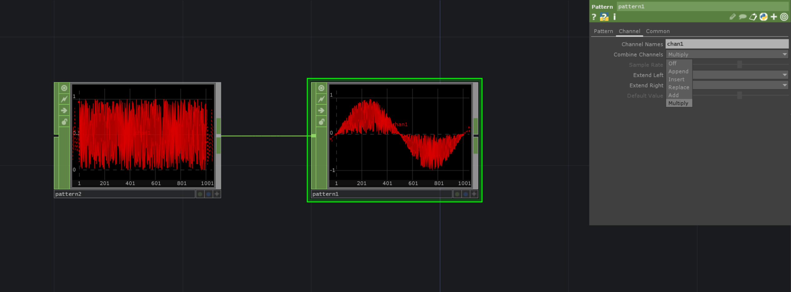

# Combining Channels in PatternCHOP
A `PatternCHOP` has an input for a `Source Input` which we can use to combine a Pattern with the input data. For that we can decide under the `Channel` tab how we want to combine the input with the Pattern. 

<!-- For example can we displace the points of a grid with this technique.
[Displace Grid with PatternCHOP](../SOPS/DisplaceGridWithPatternCHOP.md) -->