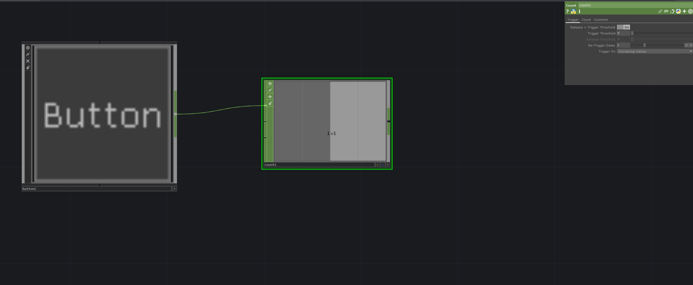

# Define How Long CountCHOP Can't Be Retriggered
The `CountCHOP` has the *Re-Trigger Delay* parameter that allows us to define for how long trigger signals get ignored, after the initial trigger happened.