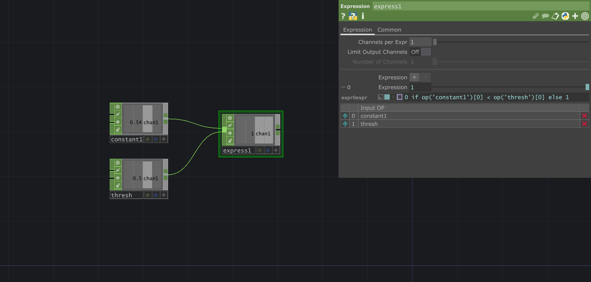
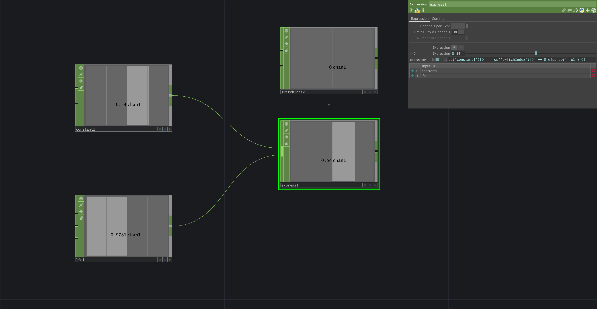

# Logic with CHOPs

## Simple Gate
To create a simple gate logic we can use an `ExpressionCHOP` with `1 if op('constant1')[0] == 0 else 0` or `>= <=`

## Simple Gate with Threshold value

We also can use the second input to set as threshold with `0 if op('constant1')[0] < op('thresh')[0] else 1`. If you only want to pass the values from *constant* when they are above the threshold use
`op('constant1')[0] if op('constant1')[0] >= op('thresh')[0] else 0`

## Switch

With the `ExpressionCHOP` we also can create switch behavior with `op('constant1')[0] if op('switchIndex')[0] == 0 else op('lfo1')[0]`

## Sample and Hold with ScriptCHOP

We can use a `ScriptCHOP` to create a sample and hold logic. For that we create a custom *Pulse* parameter with left click on `ScriptCHOP` and `Customize Operator`. We then add a `Pulse` parameter. 
In the *script_callbacks* we add for the `onPulse` method
```py
def onPulse(par):
    if par.name == 'Pulse':
        #assign current noise value to constant where the value is hold
        op('constant1').par.const0value = op('noise1')[0]
    return
...
```
Also assign a trigger from for example a `TriggerCHOP` to the *Pulse* parameter in the parameter window of the `ScriptCHOP`.

Instead of creating the Pulse parameter in the `Customize Operator` window we also can script the *Pulse* parameter. For that go into the *script_callback* and add in `onSetupParameters` method:
```py
def onSetupParameters(scriptOp):
    page = scriptOp.appendCustomPage('Custom')
    page.appendPulse('Pulse')

```
To make the changes active you need to click `Setup` btn in the operator.

## Pulsed Comparator
We can use a `ScriptCHOP` to compare values when a pulse happens. Create the *Pulse* parameter like in the example above and then in the code of the `ScriptCHOP`
```py
def onPulse(par):
    if par.name == 'Pulse':
        if op('constant1')[0] >= op('constant1')[1]:
            #Execute something
    return
```