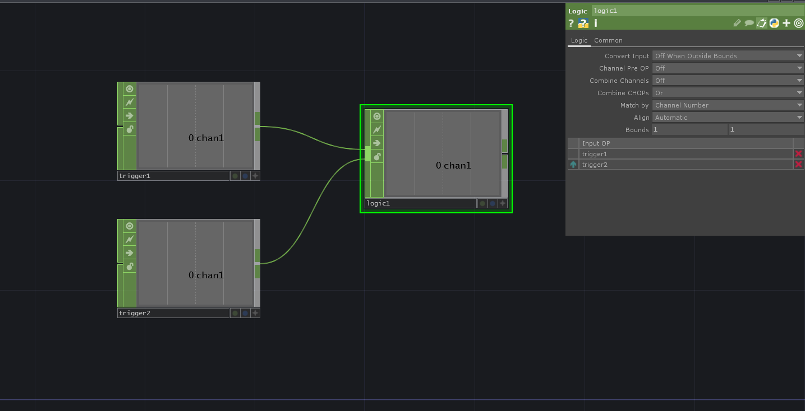

# One Output From Trigger LogicCHOP
Sometimes we run into situations where we want to trigger something when one *or* the other input of a `LogicCHOP` is outside the bounds.
In the `LogicCHOP` we set *Combine CHOPs* to `Or`.

