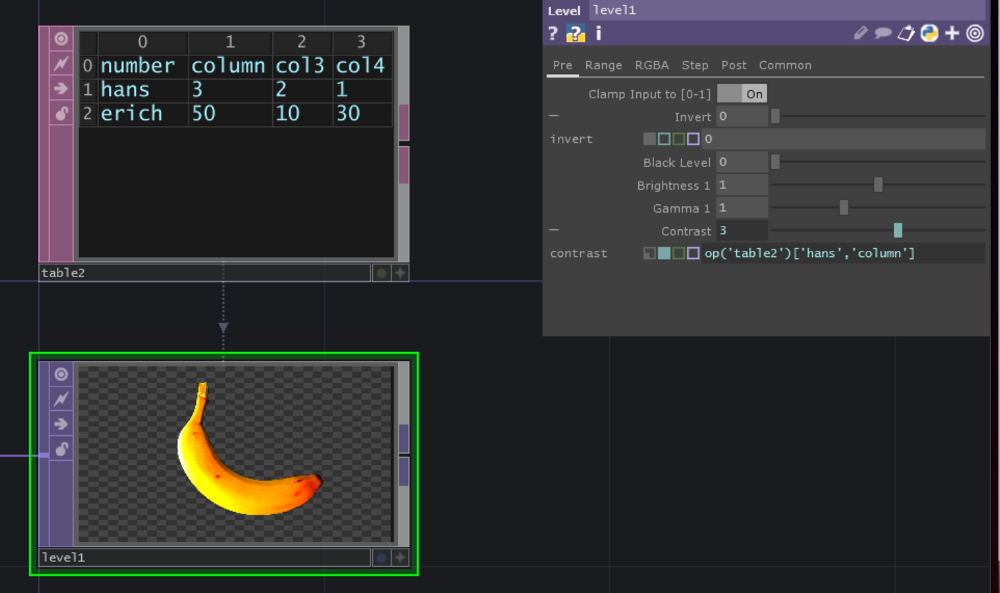

# Reference Data From DAT
There are multiple ways to reference the data from for example a `TableDAT`.

*Index of the column or row*
`op('opname')[rowIndex,colIndex]`

*Column or row name*
`op('opname')['hans','column']`

