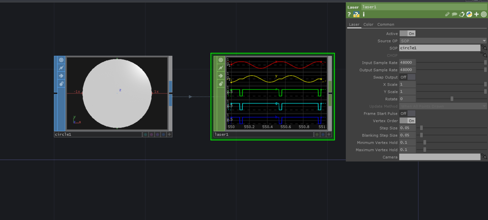
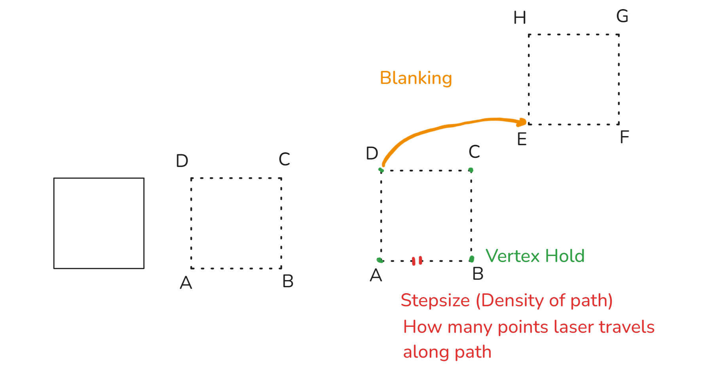

# Laser
To use lasers we need an `usbtoavb` interface. AVB stands for *Audio-visual bridging*
LA.Toolbox is a program to connect the interface with the actual laser.

When all the right drivers for the interface are installed the `usbtoavb` will be accessible as a network.

We need to set the ip address so the laser and the pc live in the same subnet.

Laser and the interface need to have the same samplerate set - 9600hz?

To normalize the projection surface we can use DGC - digital geometric connection. It is inside of `LA.Toolbox`

## Output Shapes in TD

We can directly convert the SOP into `LaserCHOP`. In the `LaserCHOP` we have to set the right frequency.

To output the laser we use `AudioDeviceOutCHOP`. So we are treating laser as if it was audio.
In the `AudioDeviceOutCHOP` we selet `ASIO Audio Driver` and our Interface e.g. `ASIO MADIFACE USB`.

## How does laser produce images

A laser only outputs one point. The laser travels/moves so fast that it looks to humans like a solid line. 

When you draw a straight line you want to draw as little points as possible but beware that lesser points make the laser less bright.

`Vertex Hold` defines how long laser should stay at each corner point of a shape. At a straight line part of your shape you dont want the laser to hold but just travel along the points.

In the angles you want nice big vertex hold so you get pointy edges.

`Blanking` defines how the laser sould travel between shapes. When we travel between shapes the laser travels but we turn of the light. You want to define the stepsize in the blanking phase. Each laser has an amount of points it can travel in a frame/second.

When you have rounded corners on your shape you need to raise max vertex holds to get cleaner corners.

If the blanking is not working properly play with step size - as high as possible so you don't lose resolution in total - and maybe `Preblanking off delay`. It describes when to turn off the laser and before the blanking and after the blanking.

Make sure that lasers stays at corners as long as it needs to but also travels to next shape as fast as possible.

## Connecting multiple laysers
If you want to control lasers you need to add a avb switch.

In TD you need to use `MergeCHOP` to put all `LaserCHOP` into one output chop.
In the `RMEAVBController` you need to define that you get one input streamd and x output streams. Each having 5 channels. 
Then assign which laser should listen to which stream.