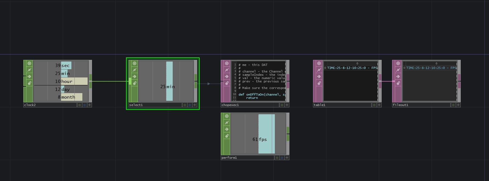

# FPS Logging
When we want to test the performance of our project we can write a *Log* and monitor the FPS over time.
For that we take a `ClockCHOP` use it's parameters and join them in a *f-string* like in the code below.

Every time the parameter changes we overwrite the first line in the `TableDAT` and pulse to write a new line into a log file with `FileOutDAT`.


```py
def onValueChange(channel, sampleIndex, val, prev):
	clock = op('clock2')
	# Get data from clock
    sek = int(clock[0])
	min = int(clock[1])
	hr = int(clock[2])
	day = int(clock[3])
	month = int(clock[4])

    # construct date
	date = f'25-{month}-{day}-{hr}:{min}:{sek}'
	fps = op('perform1')[0]

    # set date and fps as first line in table
	
    op('table1')[0,0] = f'TIME:{date} - FPS:{fps}'
    
    # pulse the writing of a new line
	op('fileout1').par.write.pulse()
	return
```


[Download Example File](../files/MonitorFPS.tox)    

