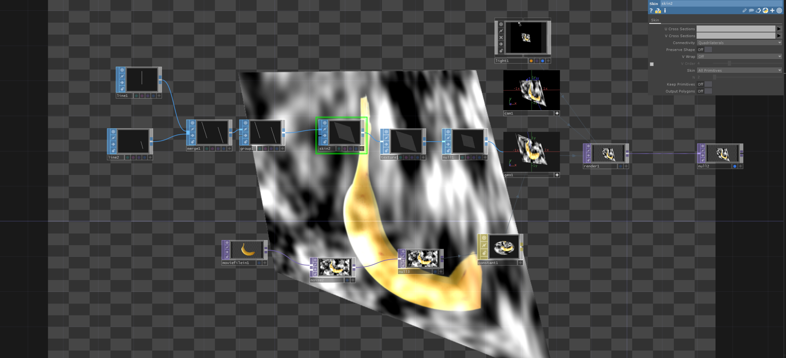

# Merge Lines into a Surface with SkinSOP

If you want to use `lineSOP` to create a surface you can combine the lines in a `mergeSOP` and then create a group of points in `groupSOP`. With the `skinSOP` you create the surface. To be able to show 
some textures on the new surface you should add a `textureSOP` before you go into the `GEO`.

[Download](../files/MergeLinesToSurface.tox)    