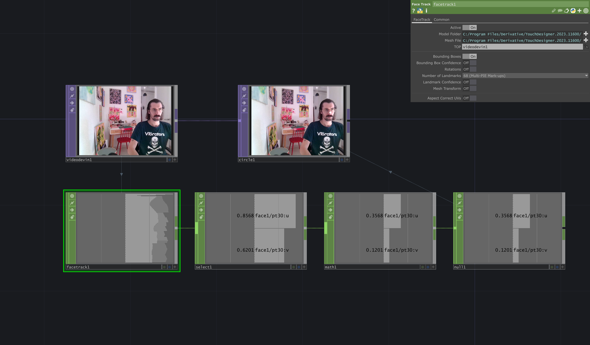

# FaceTracking
With a `VideoInTop` and the `FaceTrackCHOP` we can detect the position of the face on the screen. The `FaceTrackCHOP` allows to return the position of the face and its rotation. We also can get the positions of the single landmarks under `Number Of Landmarks` parameter. This outputs one channel for each landmark.

[Download File](../files/FaceTracking.tox)