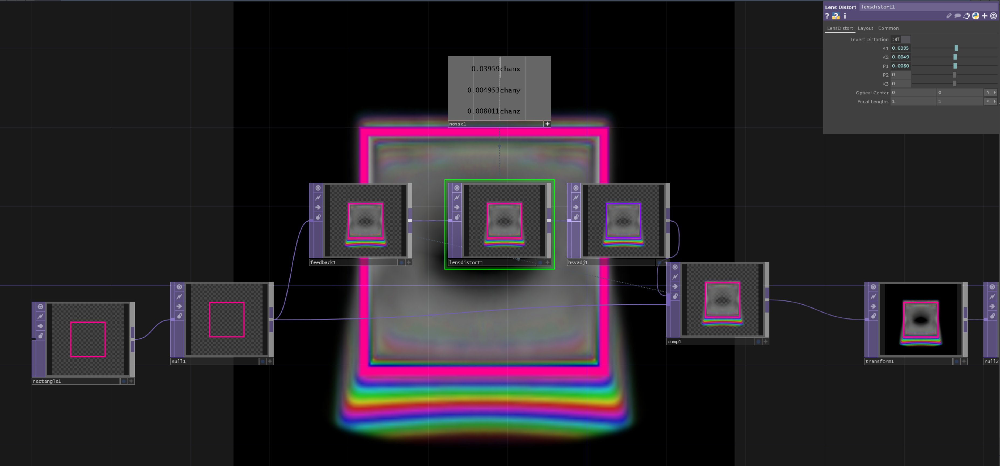

# Feedback Distortion With LensDistort

Inside a Feedback-Loop we can use a `LensDistortTOP` with values from a `NoiseCHOP` assigned to create interesting distortions.

[Download Example File](../files/FeedbackLensDistort.tox)