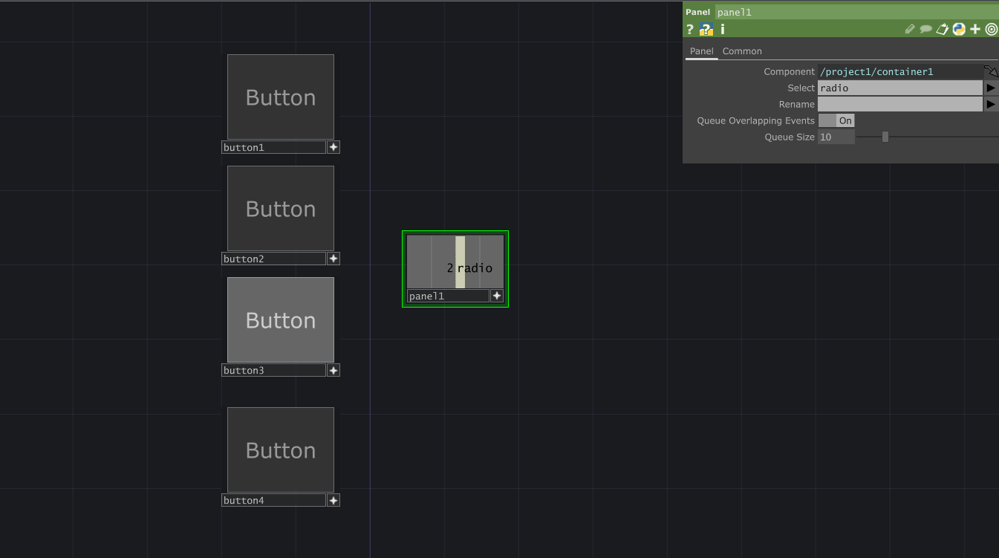

# Get Value of Current Momentary Button
If we have multiple momentary buttons in our UI and we want to get the index of the currently selected we can use a `PanelCHOP` and select the *radio* parameter.

[Download Example File](../files/MomemtaryBtnVal.tox)