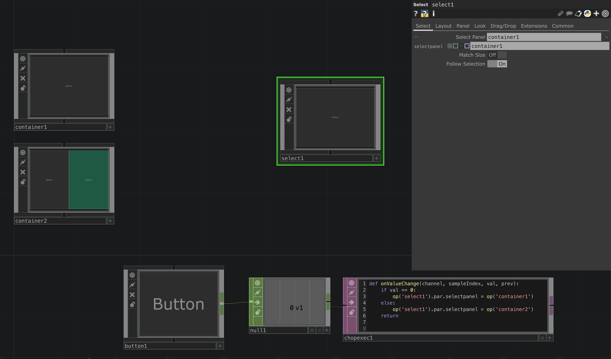

# SelectCOMP to Select Different UI Elements

If you want to change your UI depending on a value or want to use a button to control which UI is shown you can change the value of the `SelectCOMP`. In the *Download Example* a Button switches between different *Container* UIs.

[Download Example](../files/SelectCOMPS.tox)    