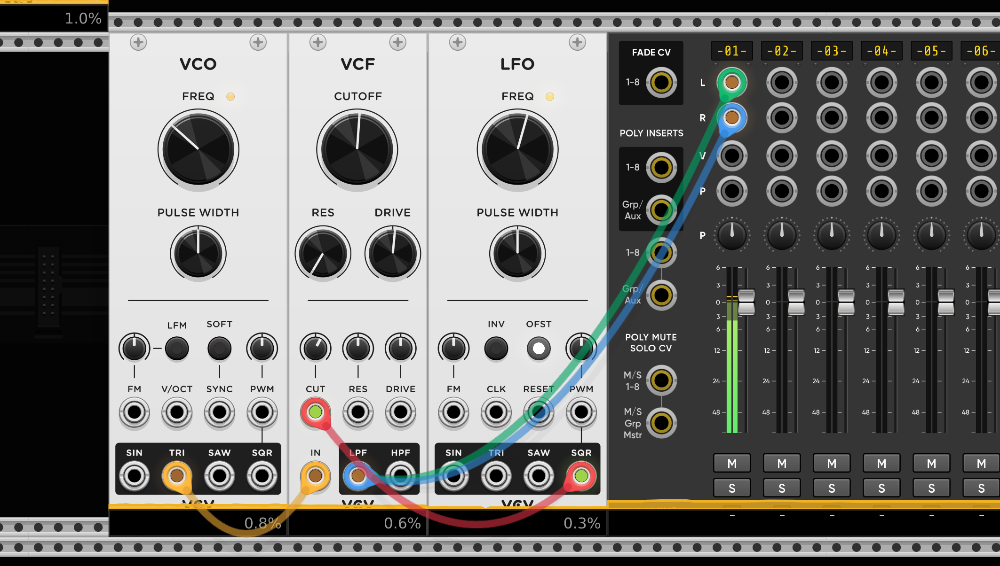

# Basics
*Modulation* is the process of changing parameters over time using a control signal. 

*Modular synthesis* uses a *modulator signal* that changes different aspects of other *carrier signals* like amplitude, frequency or timbre/tone color.

A good question to ask is: *Which principle of modulation is used in this step?*

## Basic terminology

### Modulation
*Modulation* is the use of a *signal(the modulator)* to affect or change another signal(carrier).

Some types of modulation are:
- frequency modulation
- amplitude modulation
- phase modulation
- ring modulation
- pulse-width modulation

### Audio-Rate
*Audio Rate* are frequencies that lie within the range of human hearing. These frequencies get used in synthesizer to create notes and sounds.
The *Audio Rate* frequency range lies between 20Hz and 20kHz

Note A4 -> 440Hz

### Voltage Span
All VCVrack/Eurorack modules work with *voltage* in a maximum value span of 10 Volt.

Example voltage spans:
-5V to 5V
0 to 10V
0 to 1V

### Amplitude
Level/strength of an audio or control voltage(CV) signal.

For audio the amplitude controls the loudness of a sound.

For control voltage(CV) the amplitude controls the intensity of modulation that gets applied to a signal. 

### Frequency
*Frequency* is the rate a signal oscillates. It is measured in Hertz(hz)

It mainly gets used to control the pitch of a tone, although it can control many aspects of a module. E.g. can be used to control cutoff frequency of a filter.

### Control Voltage(CV)
*Control Voltage* is one of the fundamentals of modular synthesis. It allows the communication between modules. With the CV we can control and manipulate parameters of the module like *pitch, frequency, filter cufoff, amplitude* and more.

In VCVRack all patch cables carry the same type of signal - a floating-point audio-rate signal(44.1 kHz or 48 khz) - regardless of wether its being used for audio or as *control voltage*. Conceptually, this represents a continous voltage(a smooth signal without steps) that can vary over time, measured in volts.

The CV signal can be [unipolar](#unipolar) or [bipolar](#bipolar).

In analog modular hardware the voltage range differs between audio(AC coupled) and control voltage(DC coupled).

### Clock
A *clock* signal is steady stream of triggers/pulses which can be used to synchronize modules. This synchronization is essential to produce precise and complex rhythms and patterns that align with an overall tempo.

The clock signal doesn't automatically mean the speed of something in your patch. In sequencers one clock pulse means go one step further/next order of operation.

Instead of using a clock module you can create a clock signal with a `LFO` module with a *SQRT* wave.
You can create a *clock signal* 

#### Variable Clock
We can create a *variable clock* which changes its frequency over time. For that we manipulate the frequency of a `LFO` with another `LFO` module.

### Trigger and Gates
*Trigger* and *Gate* signals get used to control timing of events like:
- Synchronizing modules
- Initiation envelopes
- Turning modules active/inactive

Both have `HIGH` and `LOW` voltage states.

#### Trigger
Short burst voltage that goes `HIGH` and directly changes its state to `LOW` - so it has no real `ON` phase. 

We can use trigger for exmple for envelopes that control sounds that don't have sustain phase.

#### Gate

## Basic Sounds
### Snare
To build a Snare we need a `Noise` module which is connected to a *high-pass-filter* that only lets through the higher sounds. With an `ADSR` module connected to `VCA` you shape how amplitude behaves when the *ADSR* is triggered by a *gate* signal.

