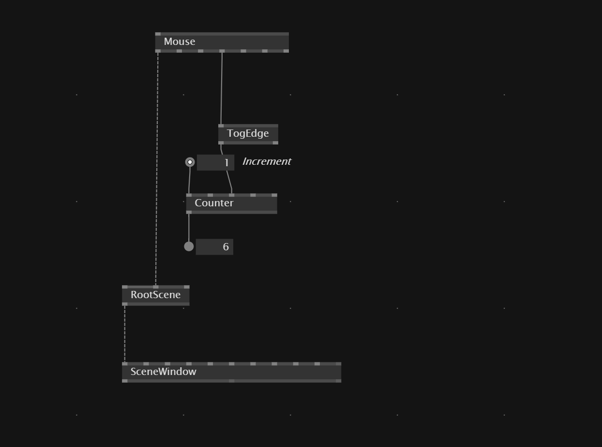

# Count On MouseClick

To create a counter on mouse click we connect `Mouse` node with a `TogEdge` to make sure that it one mouse click per frame. Otherwise counter increases value per frame while the button is hold down.