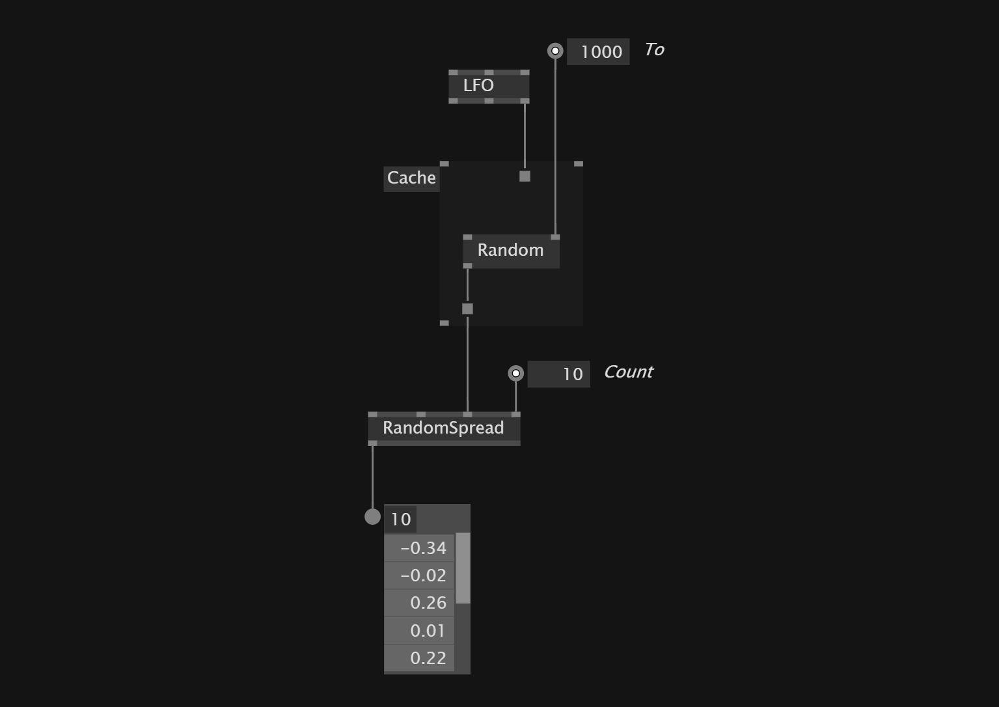

# Randomize Seed Of Randomspread
We can use a `Random(FromTo)` to randomize the seed of a random spread. Plug the `Cycles` value into the spread so every time the cycles changes a new random seed gets set for the spread.
