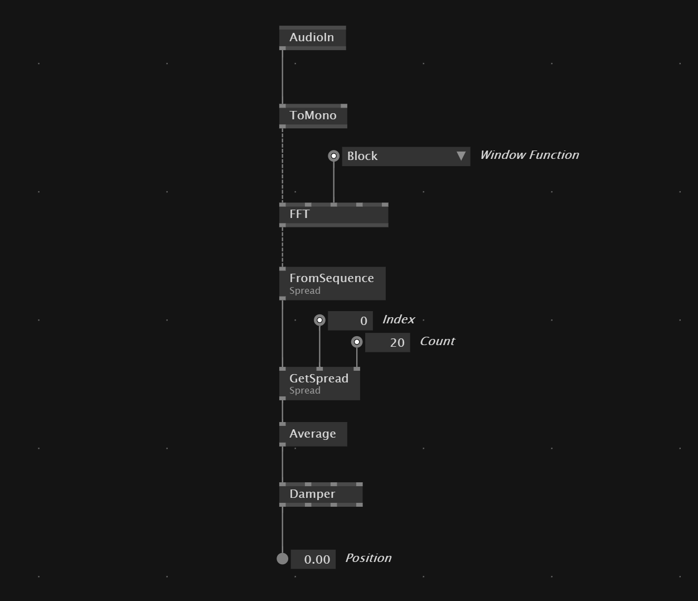

# Audio Reactive Patch
If we want to create an audio reactive patch we activate the `VL.Audio` package in the node browser and use the `AudioIn` to get the sound into the patch. We the want to convert the *Stereo* to a single channel with `ToMono`. We then can convert the `FFT` of the audio signal.

After that we convert the information into a spread with the `FromSequence(Spread)` node and select with `GetSpread(Spread)` which part of the frequency range we want to use and how much.
The `Average` node then gives us a single value that we can smoothen with a `Damper` and plug into logic or parameter that we want to change by the audio.

[Download Example File](../files/SimpleFeedbackTrail.vl)