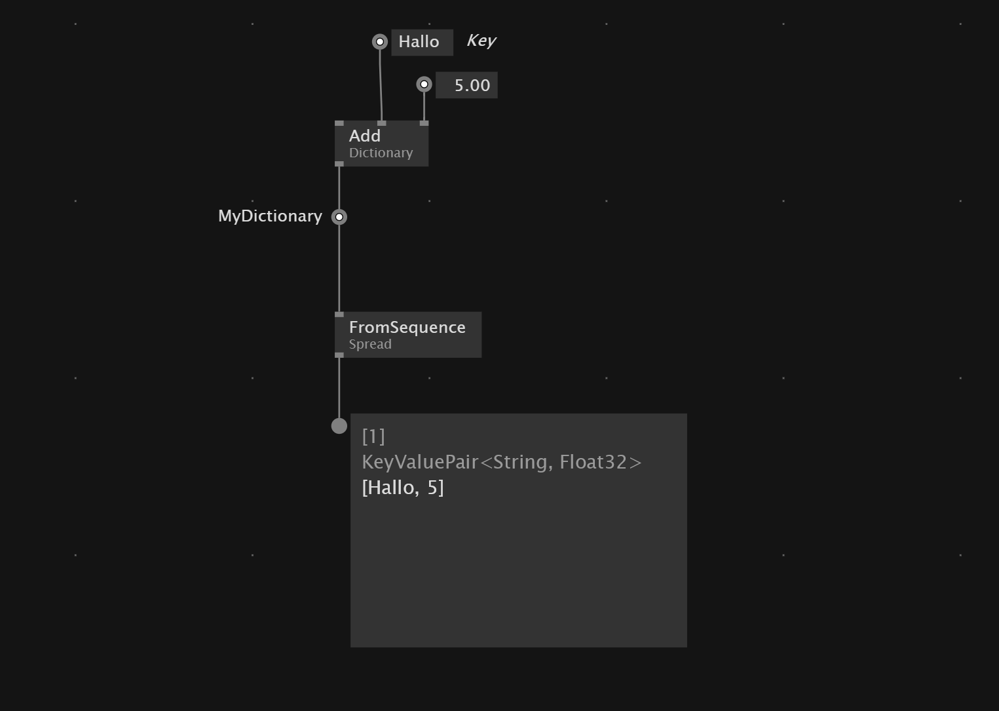
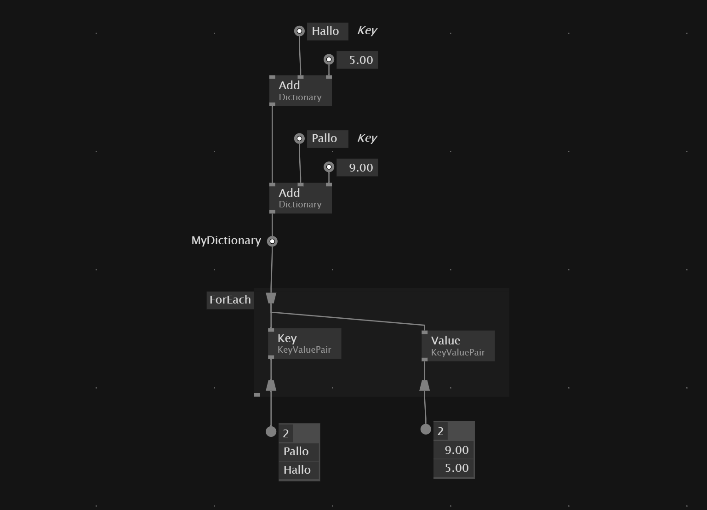

# Basics Collections
Collections are datatype's to organize data. They are tables in memory that points to other objects. 
Types of collections are `Array`,`Sequence`,`Dictionary` and `Spread`.

With an `ISpread` we create a `Spread`o f integers in a given range.

## Mutablitity
All simple collection types are immutable, but have mutable versions - they have *mutable* or *builder* in there name.

If you update an immutable collection you create a new snapshot of that table. When you update a mutable collection you directly edit that table in memory.

But just because the collection is immutable doesn't mean that the objects inside the collection are immutable. You still can have mutable objects inside the immutable collection.

## Relation to Sequence
All collections in VL are relate to `IEnumerable`. That means we always can use `FromSequence` to convert them to for example to a spread.

This also means that every *Sequence* type can be processed with `ForEach` loop. It will convert it into a `Spread`.
With `Key(KeyValuePair)` we can get the keys of the dictionary and with `Value(KeyValuePair)` the values.

## Performance
If you do a high amount of loop counts you should avoid `Add(Spread)`. Then prefer using the splicer of the loops or `Flatten` afterwards. `Flatten` reduces `Spread<Spread<>>` to single `Spread`.

If you still have performance issues try using a `SpreadBuilder`.

