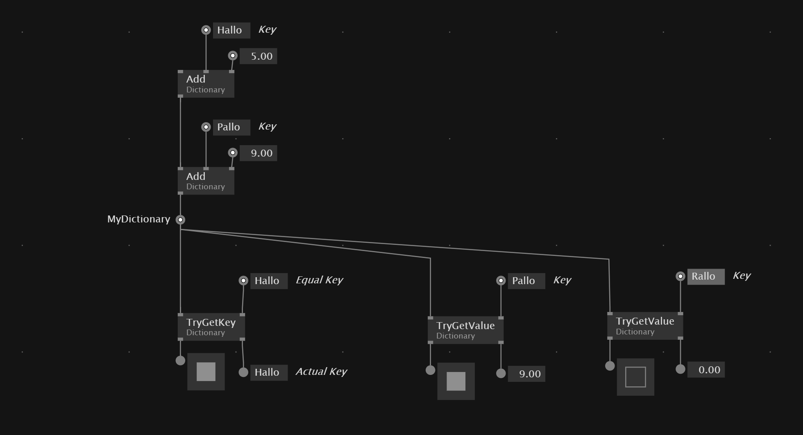

<!--  -->

# Dictionary
Dictionaries are collections that contain *key/value* pairs. They can contain the same key only once in the collection. They don't maintain the order of its items.

To add an item we use `AddItem` node. If the key already exists in your dictionary it will throw an error. Be aware that the keys are *case sensitive* so it matters if they are uppercase or lowercase. With `ToLower` we can assure they are all lowercase.

To update value of a key we can use `SetItem`. It also adds an item to the dictionary if the key *doesn't exist yet* in the dictionary.

With `Remove` we delete an element from the dictionary.

The `Clear` allows us to delete all elements of the dictionary at once.

To get single data out of a dictionary you can use `TryGetValue` and `TryGetKey`. If you want to get all you can use `Keys` and `Values`. Another way is to use `ForEach` loop and use `Split(KeyValuePair)`.

If you want multiple values use `TryGetValues`

## Sorted Dictionary
As mentioned above dictionaries normally don't keep the order of their elements. VL has under *Advanced* nodes `SortedDictionary` that maintains order of the elements but it is not as performant as normal `Dictionary`

To set type of the *key/value* pair in dictionary you need to separate it with comma - `Dictionary<String,Float32>`.
