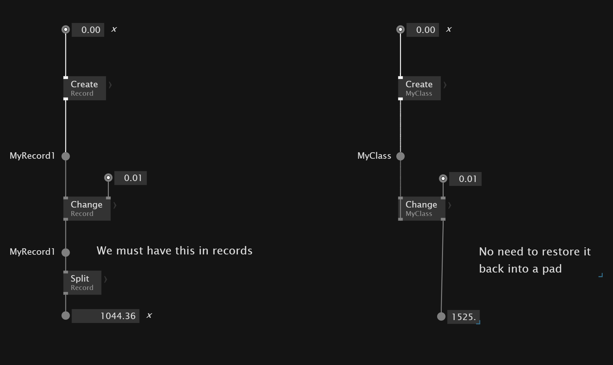
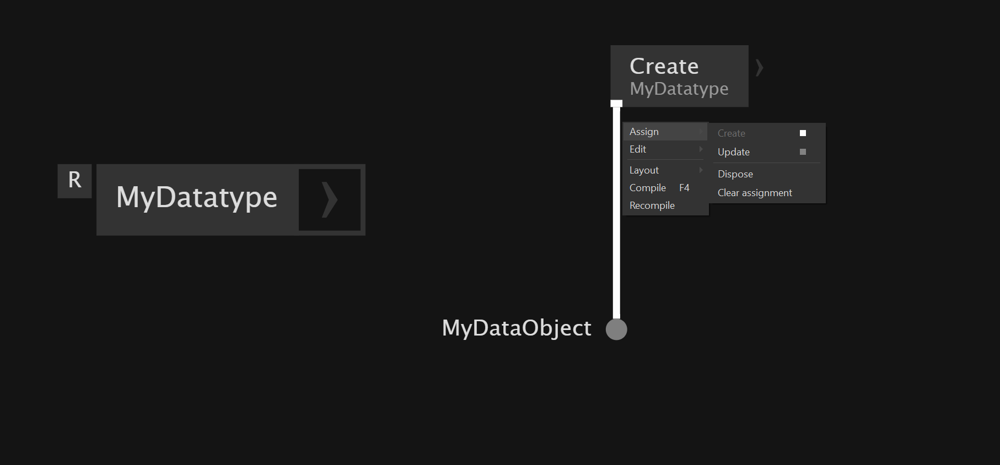

# OOP

## Mutability
*Mutable objects* can change - when updating *mutable objects* the same memory gets mutated

*Immutable objects* can't change - updating *immutable objects* creates a new copy of the object.

We also can see visually the difference. Links of *mutable objects* are dotted. The dashed lines mean that a reference to an object is passed.

If you create two pads from your `Record` you create two independent instances - if you change one the other instance doesn't get changed.

If you create two pads of a class - even with different names - they both reference the same instance and will affect the same instance.

Records must be explicitly stored to update them. Classes don't because we always pass the reference to that instance.

The advantage of class over record is when you have child objects inside your datatype and you only want to change a child state - with a `Class` you reference the child update operation. With a `Record` you would have to reconstruct the whole object to be able to store the changes for the child back into the `Record`. There is `TryReplaceDecendant` which allows you to repack the object in `Record`.

In general try to avoid parallel execution of operations. Use top to bottom flow.

## Overwriting properties in instance
You can create new operations to overwrite the values of the properties in the record or class.

## Change detection
If you have expensive processes it makes sense to only execute these when needed. We trigger these operations if a change of the object is detected.

On Records changes of data can be detected with `Changed`.
With Class objects `Changed` ony detects if a new class instance is assigned/created.

### Detection of changes in classes

#### Workaround 1

A way to detect changes in classes is to use `BehaviorSubject` reference which notifies subscribers when it has an update for the subscribers.

#### Workaround 2

The other way is to implement a ticket system. Look [here](TicketSystem.md) for more information.

## Order Of Operation

When we work with classes wee don't have to store the changes back into a pad. This allows us to execute operations in parallel. But to avoid problems with the order classes should also use the top to bottom data flow.

With Records we always have to store the changes back into the pad so parallel execution of operations is not possible. 

Another way to specify the order of operation is when you have your classes operating as a process node. Then you can change the order of operation *inside the process node menu* by dragging them up and down.

To specify the order of operation in classes we also can use `Do` regions. They are executing code inside the region before anything else connected to the region. So it allows us to handle or store data in a certain stage of execution.

## Undo Changes Of Record
We can use `Undo` node to store certain states and trigger an undo action to jump back to previously pushed states.

## Advanced

### Create Reference of Record
If you want to have the flexibility with references for your record you can use `Create(Reference)`.

### Take snapshop of Record state
When we update a `Record` it creates a new copy that get's stored back into the pad. This allows us to ccreate snapshots of these copies.

In Classes we would get a snapshot of the reference which would give us the current instance of the class.

## Inheritance and Interfaces

### Inheritance
*Inheritance* allows parent-child relationship between objects. The children are more specilized version of the objects that inherit functionality and properties from the parent. In *VL* we can't create inheritance.

### Interfaces
*Interfaces* are special definitions that contain signatures of methods you want to share among different classes. An *interface* is like a rule that says:"You need to have this property and this method" to be able to subscribe to this interface.

Multiple objects can implement multiple interfaces and share functionality.

Interfaces start with a capital `I` like `IEnumerable`. `IEnumerable` is renamed to `Sequence` in VL. It allows the iteration over a collection of objects.
Interfaces can be inherited in VL.

To implement an interface in a class or Record you have to go inside their definition and on the left side in the Patch Explorer you can add interfaces.

## Upcasting and Downcasting
*Upcasting* and *Downcasting* is about how to convert between parent and child classes.

### Upcasting
From specialized to general type.
*Inheritance*: child to parent
*Interfaces*: object to interface

### Downcasting
From general type to specialized type.
*Inheritance*: Parent to child
*Interfaces*: Interface back to original object

For that we can use `CastAs` node.

[Downcasting Img](../img/Downcasting.png)

Success event triggers the execution of the if because we only wants this to happen if the casting works.

Casting only tells the compiler to treat a type as another type. It doesn't actually change the type.

There is also a `HardCast` It gives an error when something is wrong with casting.

## Filtering out types of sequence
`OfType` executes a `CastAs` on every item in a collection and only the ones that pass it get kept in the collection. It returns an empty collection if nothing matches the type of the downstream operation.

[Downcasting Img](../img/FilterOutDataTypesSequence.png)

# Old

VVVV has different ways to create your own datatypes and objects. They allow you to define fields and operations.

In VVVV there are:
- *mutable* datatypes - object can be changed after creation
- *immutable* datatypes - object cannot be changed after creation

The `Create` operation is the *Constructor* of your datatype - it creates instances of your datatype.

If you use `Create` operation constantly it overwrites the object on every frame. To execute the `Create` of the datatype only once we can assign the `Create` of our datatype to the `Create` operation of our patch. We then can store it into the a `Pad`. After that the data can be updated and stored back into the `Pad` again.

The `Split` operation makes the data from inside the datatype available on the outside.

If we are updating the values of our datatype we can't store the changes directly inside the datatype. We have to store the changes back into a `Pad` to have the changes stores and applied.

With `Classes` you don't need to store the changes back into a Pad. Classes are mutable datatypes so the can be changed after creation. For example if we have a collection like a *spread* of instances of our class we don't need to store the changes back into the spread afterwards.

You create an instance in the `Create` and then you can run update without restoring the changes. The update mutates the original data instance.

You use `Records` we you work with a top to bottom dataflow.

You use `Class` when you have a storage of objects and you want to run some operations on them and keep their own state.

For performance it is more effective to not copy some complex object each time it is changed.

### Naming Outputs Class
When we create an output in the class that is only for one operation outside of it we name the output like the property that is exposed to the outside like *GetPosition*.