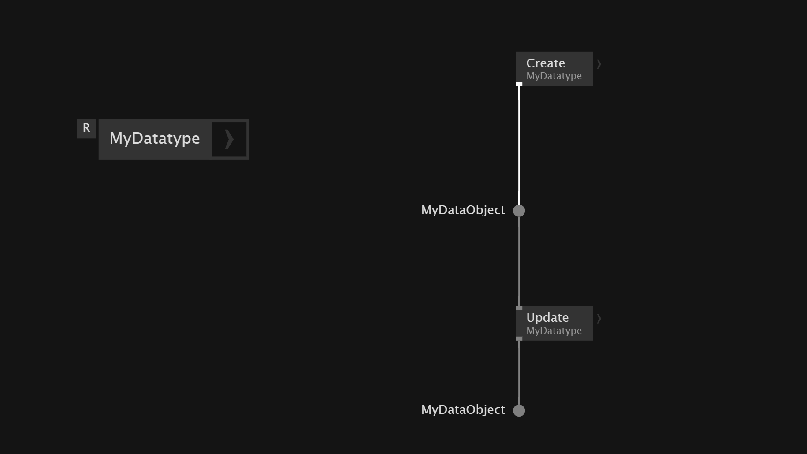

# Own Datatype
VVVV has different ways to create your own datatypes and objects. They allow you to define fields and operations.

In VVVV there are:
- *mutable* datatypes - object can be changed after creation
- *immutable* datatypes - object cannot be changed after creation

The `Create` operation is the *Constructor* of your datatype - it creates instances of your datatype.

If you use `Create` operation constantly it overwrites the object on every frame. To execute the `Create` of the datatype only once we can assign the `Create` of our datatype to the `Create` operation of our patch. We then can store it into the a `Pad`. After that the data can be updated and stored back into the `Pad` again.

The `Split` operation makes the data from inside the datatype available on the outside.

If we are updating the values of our datatype we can't store the changes directly inside the datatype. We have to store the changes back into a `Pad` to have the changes stores and applied.