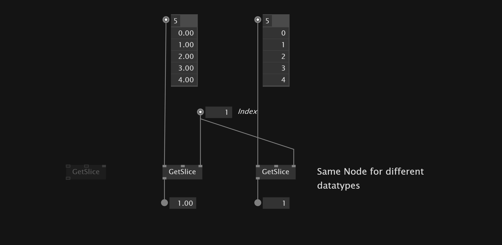
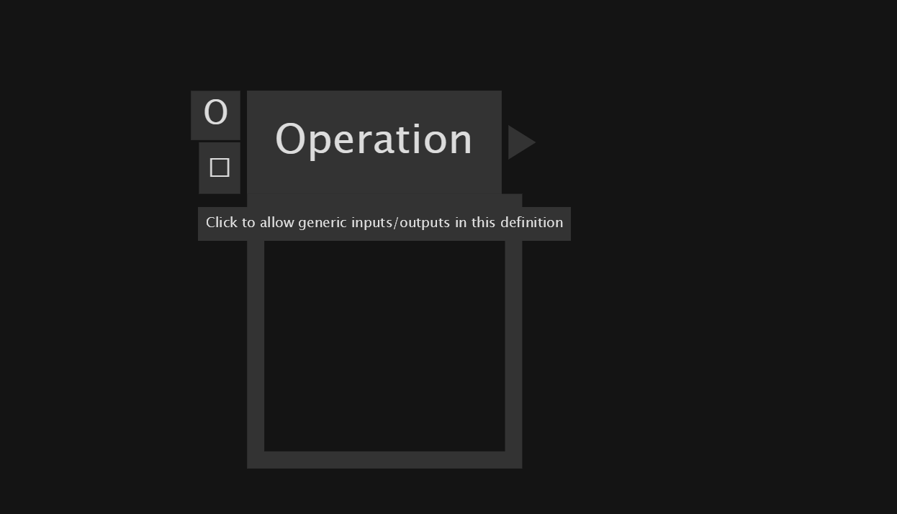
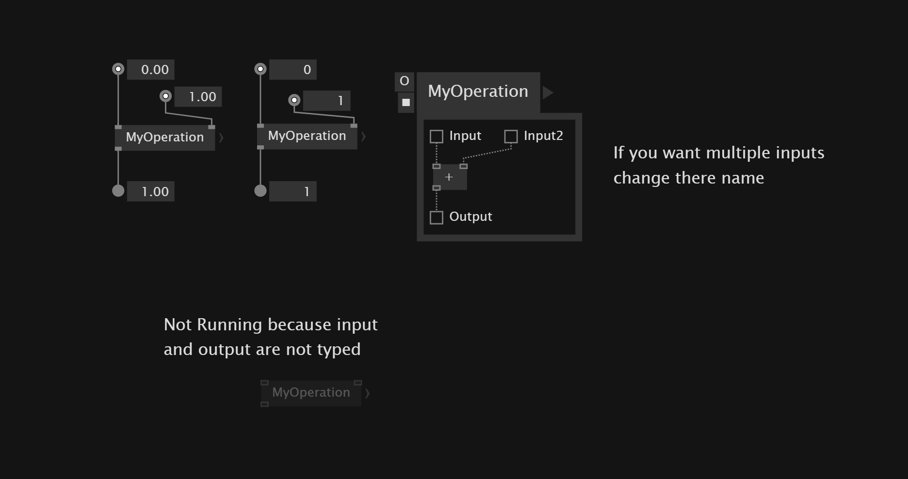
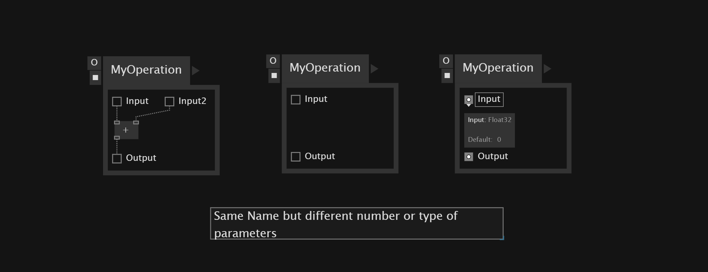

# Type Flexibility

## Generics
*Generics* are like a blueprint that allows to use the same functionality for different data types. Practically it means that we can use the same node for different data types. These generic nodes are grayed out when we place them in the patch because they wait to receive the data type the should operate on.

To set the data type for the generic node we can double click on the node.

## Generic Functions
If you want to create a *generic* function that can act on different data types as inputs you can use `Operation`.

To make an `Operation` generic you have to click on the square under the *O* of the operation. This allows to set the inner context of the operation by the inputs and outputs(outer context) of the operation.

## Overloading 
*Overloading* is another concept of *type flexibility*. It allows to have the same name for operations as along as they have different signatures. A *signature* is a unique identifier of that operation which includes:

In this context, signature refers to the unique identifier of a method, which includes:
- Method name
- Number of parameters
- Types of parameters
- Order of parameters

Different pin names don't result to a *unique identifier*