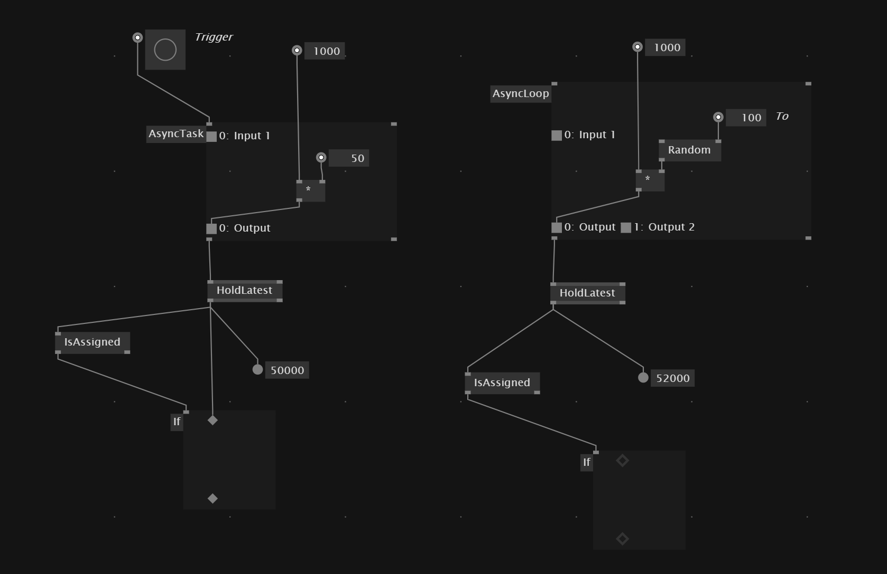

# Async
If we want to execute some behavior asynchronously on the side, while the program continues running, we can use a `Async Loop` or `Async Task`. *Async* behavior avoids freezing of the application.

An `Async Task` gets executed only once on a `Bang` event.
`Async Loop` runs continuously -  as fast as it can

`IsAssigned` gives back true if new value after execution is assigned, which allows to only show something if new value got assigned.

The *Async* regions also have the `In Progress` outputs which allow us to execute/show information while the async task is working and we want to show for example a loading screen.