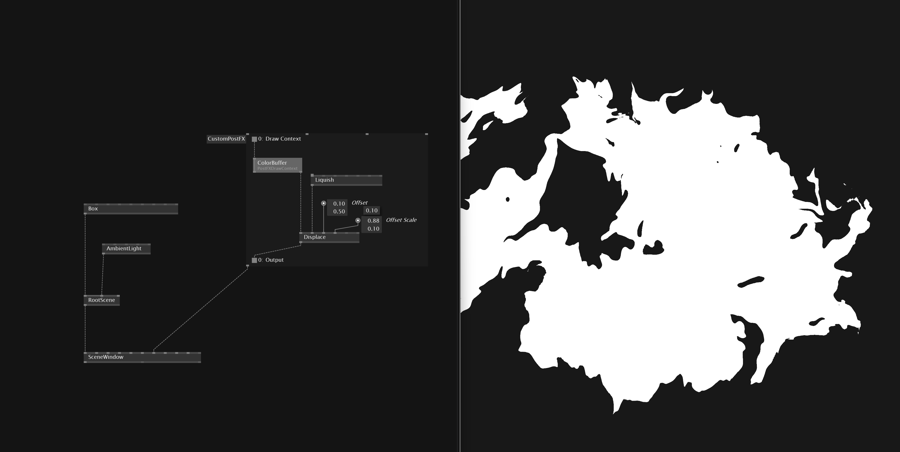

# Create Custom PostFX

Besides the Standard PostFX we also can create our own custom post fx. For that we need `CustomPostFX` region from Stride. The `ColorBuffer(PostFXDrawContent)` gives us the currently renderer frame. In the *Region* we then can apply different texture effects.

[Download Example File](../files/CustomPostFXStride.vl)