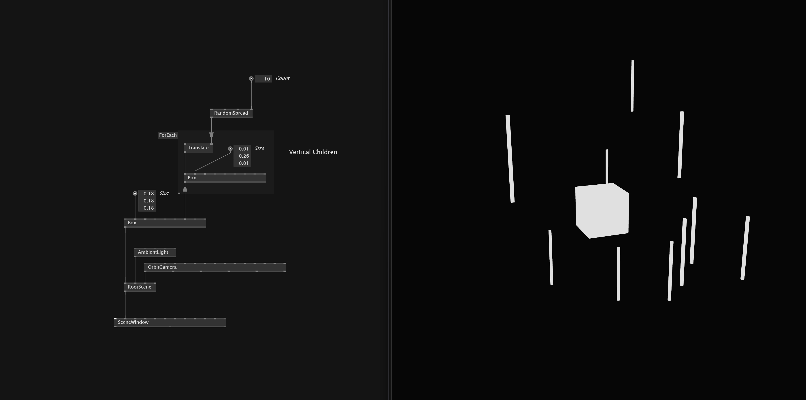
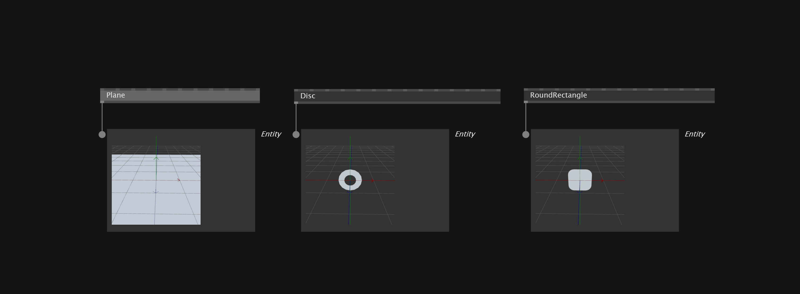
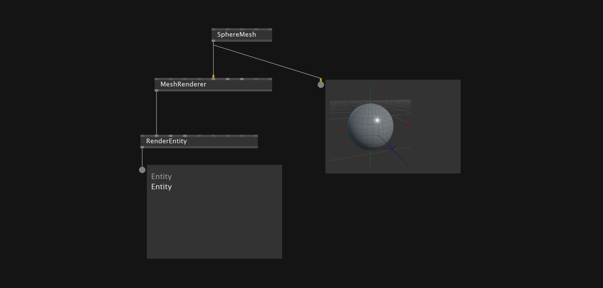
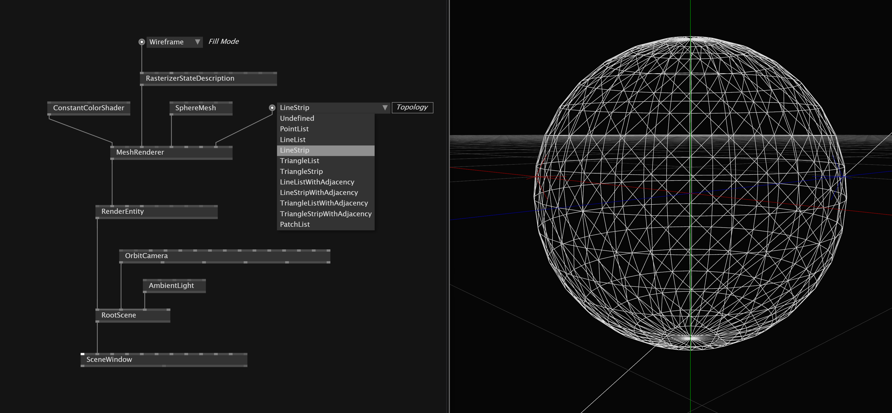
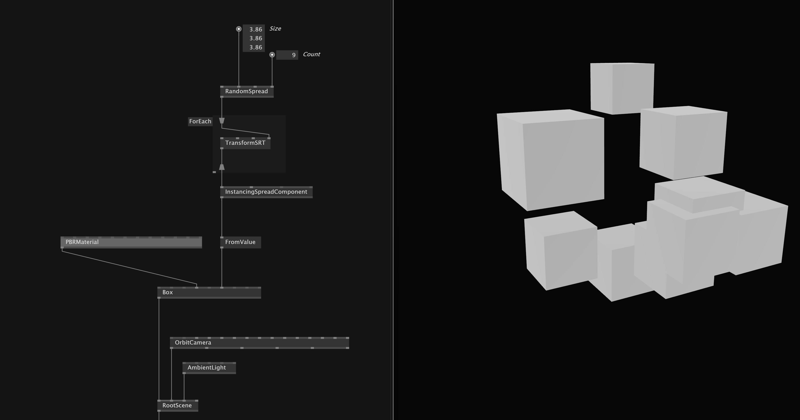
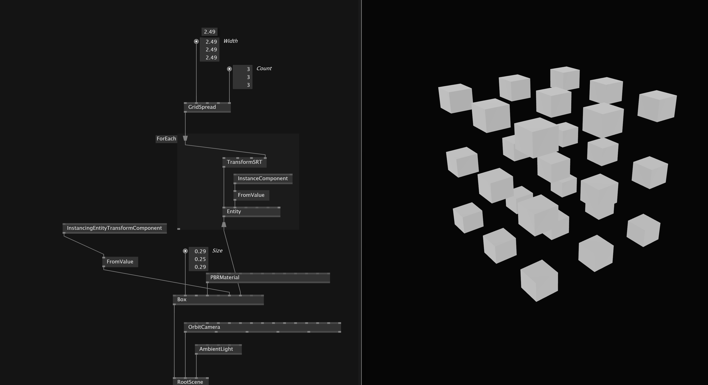

# Stride Basics

## Stride Scene

### Entity

A *Scene* in Stride contains *Entities* which are the building blocks of the 3D scene - `Plane`, `Sphere`,`Box`, `Camera`, `Lights`.

Each entity can also be a parent of spread of child entities. We can plug them into the `Children` input of an entity. This also allows us to create herachies where the children transformations behave relative to the parent transformation. A way to group the children is either with `Cons` node or a `Spread`.

On the `Components` input of the entity we can add special behavior and functionality - for example physics behavior, Instancing and more.

## Stride Transformations
Stride has different ways to transform an entity. We can use `TransformSRT` but also use instead the *matrix operations* `Translation`,`Rotation`,`Scaling` of type `3D.Matrix` as well as `Translate`,`Rotate`,`Scale` of type `3D.Transform`.

==??? What is the actual different between them?===

## 2D Primitives 
In *Stride* we have the 2D primitives `Disc`,`Plane` and `RoundRectangle`

## 2D Meshes
If you specifically want to draw meshes you need a `MeshRenderer` which then gets connected to a `RenderEntity`.

## Draw Wireframe Mesh
To render as Mesh as wireframe we need to add `RasterizerStateDescription` and set the Fill mode to `Wireframe`. For the color of the wireframe we add a `ConstantColorShader`. The `Topology` parameter of the `MeshRenderer` allows different kinds of Wireframes. It is worth experimenting with them.

## 3D Primitives
Stride provides basic 3D primitives like `Box`,`Sphere`,`Cylinder`,`Cone`,`Torus` or `Capsule` as well as `GeoSphere`. These primitives are also available as Meshes.

## Instancing
There are several ways to instance shapes in VVVV.

### Instancing Spread Component
One way to instance shapes in VL.Stride is to use the `InstancingSpreadComponent`. For that we create *Transformation Matrix data* in a Sequence like a `Spread` and use it as the `Instance Transformations` input.
For a random position of our primitive we can for example use a `RandomSpread(3D)`, set its values in an `ForEach` to the `Translation` or `Rotation` and then use that data for the `Instance Transfromations` of the `InstancingSpreadComponent`.

To be able to use the data for the `Components` input of the primitive, with a `FromValue(Spread)` node, we need to convert it into `Spread<EntityComponents>`.

The `InstancingSpreadComponent` has a `ModelTransformUsage` parameter that allows to define how the world matrix data of the instanced shape gets multiplied with the transformations of the main instance.

### Instancing Component
Another option is to take the data and create for each entry an *Entity* where we pass `InstanceComponent`. The entities we then pass as a children to the mesh.

### GPU Buffer
For more flexibility we can use *GPU buffer* to do instancing. But you have to patch the buffers yourself.

After creating the transformation data we need to create the inverse matrices to get the correct normal transformation during the light calculations. When you transform geometry with transformation matrix the vertices and normals need to be treated differently.
`transformedVertex = matrix * originalVertex`
`transformedNormal = inverseTranspose(matrix) * original Normal`

We pass the converted data into `DynamicBuffer` that we then can use as the inputs for the `InstancingBufferComponent`.

With the `InternalArray(Spread)` we convert a spread to a mutable array datatype.

The `FromPointCloud` node constructs a bounding box with all points.

## Lights

### Skybox Light
We can add cubemaps and other textures to a `SkyboxLight`.

## Draw Image in Stride
To show an image inside our stride scene we can use `QuadRenderer` or `FullScreenQuadRenderer` and assign a `FileTexture` or a generative texture from `VL.Stride.TextureFX`

## Keyboard Shortcuts
F2 - Performance meter
F3 - Profiler - When active you can hit F5 to cylcle through cpu,gpu events.
F4 - Debug View - Grid with measurments, coordinate system, light source, camera
R - Reset OrbitCamera View in Window